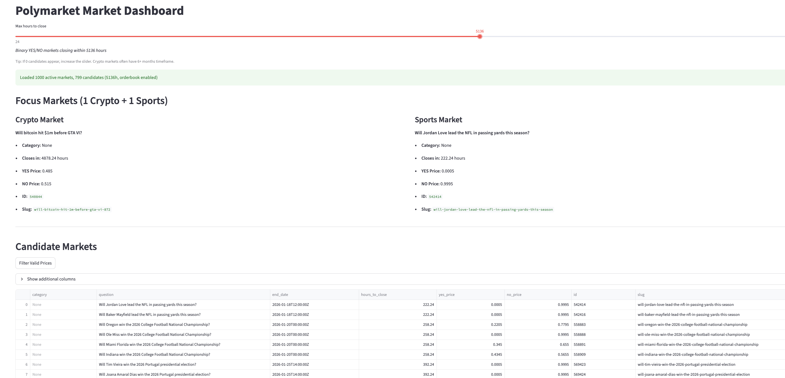

# Polymarket Market Dashboard

Interactive dashboard for viewing Polymarket binary YES/NO markets.



## Quick Start

```bash
python3 -m venv .venv
source .venv/bin/activate
pip install -r requirements.txt
streamlit run app.py
```

## Usage Note

The default filter is **48 hours**. If no candidates appear, use the **slider at the top** to extend the time window (up to 720h / 30 days). Market availability varies by time.

## APIs Used

- **Gamma Markets API** (`https://gamma-api.polymarket.com/markets`): Fetches market list with pagination

## Performance

- **Concurrent fetching**: Uses `ThreadPoolExecutor` to fetch multiple API pages in parallel (10 workers), significantly reducing load time for large datasets
- **Server-side filtering**: Passes `active=true` and `closed=false` to API to reduce response size
- **Streamlit caching**: Results cached for 5 minutes (`@st.cache_data`) with manual refresh button

## Filtering Rules

Candidate markets must satisfy:

1. `enableOrderBook == true`
2. `active == true` and `closed == false`
3. `0 < hours_to_close <= slider value` (configurable, default 48h)
4. Valid `clobTokenIds` (exactly 2 tokens for YES/NO)

## Missing Price Handling

When `yes_price` or `no_price` is empty, the `price_note` field explains why:

- `"outcomePrices missing or insufficient length"` - API didn't return price data
- `"outcomePrices contains unparseable values"` - Price values couldn't be parsed

Use the **Filter Valid Prices** button to hide rows with missing prices.

## Category Classification

| Category   | Detection Method                                                          |
| ---------- | ------------------------------------------------------------------------- |
| **Crypto** | Word-boundary match on: crypto, bitcoin, btc, ethereum, eth, solana, etc. |
| **Sports** | Word-boundary match on: nfl, nba, mlb, soccer, football, basketball, etc. |

Keywords are matched in both `category` and `question` fields using regex word boundaries to avoid false positives.

## Project Structure

```
polymarket-task/
  app.py              # Streamlit entry point
  requirements.txt
  src/
    clients/
      gamma.py        # Gamma API client with pagination
      clob.py         # (Optional) CLOB price client
    core/
      models.py       # MarketRecord dataclass
      parse.py        # JSON/array parsing
      filters.py      # Candidate filtering
      select_focus.py # Crypto/sports selection
```
